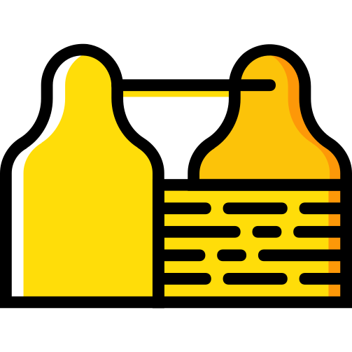

import {Meta} from '@storybook/addon-docs';

<Meta title="Info/Tools Platform"/>

  
  <h1>Storybook: Tools Platform</h1>

  Documentation on the components used to build the Tools Platform.

  The application is built using a [**component-driven**](https://componentdriven.org)
  process starting with atomic components and ending with pages.

  <h1 className="red">Disclaimer</h1>
  🚧 This project is still under construction. 🚧

